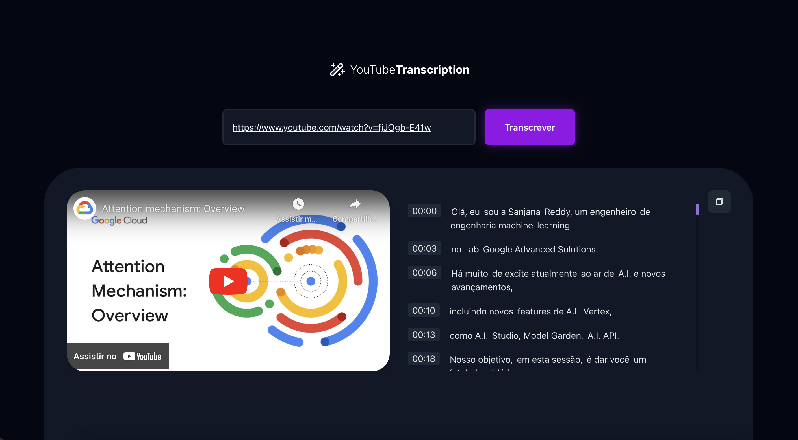

# Transcribe YouTube videos



## Description

<p>This project aims to demonstrate how to transcribe YouTube videos through artificial intelligence</p>

## Back end

<p>The backend is located in the "server" folder, it will be used only localment and does not have the structure to be put into production</p>

### How to run

```
npm run server
```

## Front end

<p>Enter the url of the youtube video in the input and get the transcript.</p>


### How to run

```
npm run dev
```
